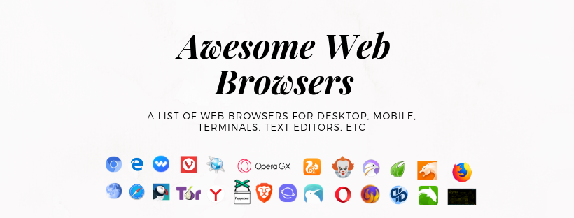

# Awesome Web Browsers 
> A list of awesome web browsers for Desktop, mobile, terminals, text editors, VR devices, etc

## Contents
- [Desktop Web Browsers](#desktop-web-browsers)
- [Headless Web Browsers](#headless-web-browsers)
- [Mobile Web Browsers](#mobile-web-browsers)
- [Terminal Web Browsers](#terminal-web-browsers)
- [Text Editor Web Browsers](#text-editor-web-browsers)
- [Virtual Reality Web Browsers](#virtual-reality-web-browsers)
- [Web Browser News and Resources](#web-browser-news-and-resources)
- [Maintainers](#maintainers)

## [Desktop Web Browsers](https://en.wikipedia.org/wiki/Web_browser)
- [Brave Browser](https://brave.com/)
- [Blisk](https://blisk.io/)
- [Chromium](https://www.chromium.org/getting-involved/download-chromium)
- [Firefox](https://www.mozilla.org/en-US/firefox/new/)
- [Google Chrome](https://www.google.com/chrome/b/)
- [Konqueror Browser](https://kde.org/applications/internet/org.kde.konqueror)
- [Midori](https://www.midori-browser.org/)
- [Microsoft Edge](https://www.microsoft.com/en-us/windows/microsoft-edge)
- [Opera Browser](https://www.opera.com/)
- [Opera GX Browser](https://www.opera.com/gx#start)
- [Palemoon](https://www.palemoon.org/)
- [Penny Wise](https://github.com/kamranahmedse/pennywise)
- [Tor](https://www.torproject.org/)
- [Safari](https://www.apple.com/safari/)
- [Qutebrowser](https://www.qutebrowser.org/)
- [Vimb](https://github.com/fanglingsu/vimb)
- [Vivaldi](https://vivaldi.com/)
- [Wexond](https://github.com/wexond/wexond)

## [Headless Web Browsers](https://en.wikipedia.org/wiki/Headless_browser)
- [Pupeteer](https://github.com/GoogleChrome/puppeteer)

## [Mobile Web Browsers](https://en.wikipedia.org/wiki/Mobile_browser)
- [Brave Browser](https://brave.com/)
- [Dolphin Browser](http://dolphin.com/)
- [Puffin Browser](https://www.puffin.com/)

## [Terminal Web Browsers](https://en.wikipedia.org/wiki/Text-based_web_browser)
- [Lynx](http://lynx.browser.org/)

## Text Editor Web Browsers
- VS Code
	- [Browser Preview](https://marketplace.visualstudio.com/items?itemName=auchenberg.vscode-browser-preview)
- Atom Editor
	- [browser-blus](https://atom.io/packages/browser-plus)
	- [atom-browser](https://github.com/sean-codes/atom-browser)
- Emacs
	- [EWW browser](https://www.youtube.com/watch?v=GtFz19gj-m4)

## Virtual Reality Web Browsers
- [Firefox Reality](https://mixedreality.mozilla.org/)

## Web Browser News and Resources

- YouTube
	- [YouTube - Google Chrome Developers Channel](https://www.youtube.com/channel/UCnUYZLuoy1rq1aVMwx4aTzw)
	- [Chrome University - Playlist of talks from Google's internal training for new Chrome engineers](https://www.youtube.com/playlist?list=PL9ioqAuyl6UIFAdsM5KU6P-hRJdh-BPmm)ç
- Twitter Accounts
	- [Intent to Ship](https://twitter.com/intenttoship)
	- [Microsoft Edge Dev](https://twitter.com/MSEdgeDev)
	- [Microsoft Edge](https://twitter.com/MicrosoftEdge)
	- [Google Chrome](https://twitter.com/googlechrome)
	- [Chrome Developers](https://twitter.com/ChromiumDev)
	- [Chrome UX Report](https://twitter.com/ChromeUXReport)
	- [Chrome DevTools](https://twitter.com/ChromeDevTools)
	- [Firefox Devtools](https://twitter.com/FirefoxDevTools)
	- [Firefox Nightly](https://twitter.com/FirefoxNightly)
	- [Firefox](https://twitter.com/firefox)
	- [Spider Monkey JS](https://twitter.com/SpiderMonkeyJS)
	- [V8](https://twitter.com/v8js)
	- [W3C Technical Architecture Group](https://twitter.com/w3ctag)
	- [W3C](https://twitter.com/w3c)
	- [Webkit](https://twitter.com/webkit)
	- [HTTP Archive](https://twitter.com/HTTPArchive)
	- [Lighthouse](https://twitter.com/____lighthouse)
- GitHub
	- [GitHub - W3C Technical Architecture Group](https://github.com/w3ctag?type=source)
	- [W3C specs and API reviews](https://github.com/w3ctag/design-reviews)
	- [GitHub - Google Chrome](https://github.com/googlechrome)
	- [GitHub - Firefox](https://github.com/mozilla)
	- [Nagalfar - a toy web browser implemented in rust from scratch](https://github.com/maekawatoshiki/naglfar)
	- [Robinson - a toy web browser implemented in rust from scratch](https://github.com/mbrubeck/robinson)

- Books
	- [High Performance Browser Networking](https://hpbn.co/)
	- [Architecture of Open Source Applications - Selenium Web Driver Implementation Overview](http://aosabook.org/en/selenium.html)

## Maintainers
- [Clifford Fajardo](https://github.com/cliffordfajardo)

## License

